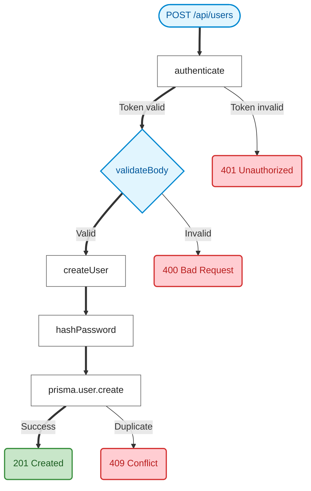
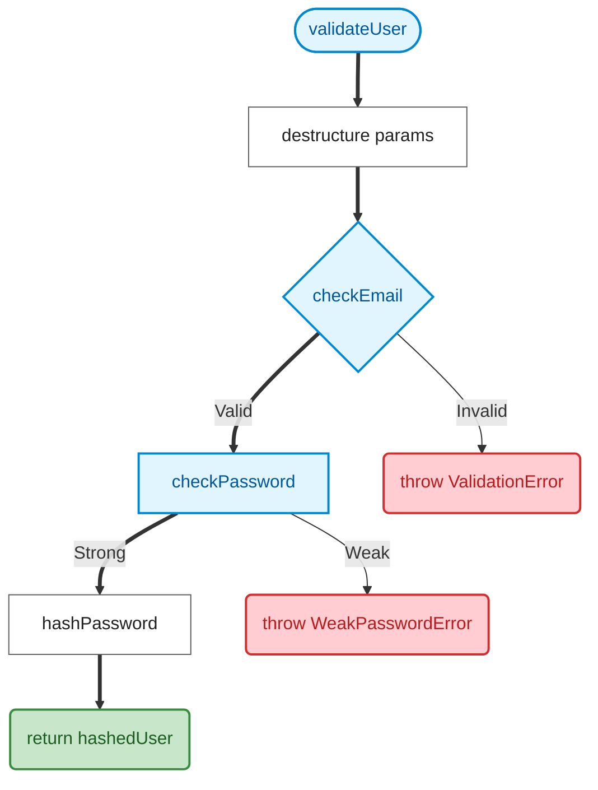

# Mermaid.js Flowchart Generation

Generate Mermaid flowcharts from trace `path_history` for visual rendering in GitHub, Obsidian, Notion.

---

## Style Definitions

Always include these `classDef` blocks at the end of every generated flowchart:

```mermaid
classDef entry fill:#e1f5fe,stroke:#0288d1,stroke-width:2px,color:#01579b;
classDef success fill:#c8e6c9,stroke:#388e3c,stroke-width:2px,color:#1b5e20;
classDef error fill:#ffcdd2,stroke:#d32f2f,stroke-width:2px,color:#b71c1c;
classDef branch fill:#e1f5fe,stroke:#0288d1,stroke-width:2px,color:#01579b;
classDef step fill:#fff,stroke:#616161,stroke-width:1px,color:#212121;
```

## Node Shape Mapping

| Step Type | Shape | Syntax | Example |
|-----------|-------|--------|---------|
| Entry point | Stadium | `([text])` | `S0([POST /api/users])` |
| Normal step | Rectangle | `[text]` | `S1[authenticate]` |
| Branch point | Diamond | `{text}` | `S2{validation}` |
| Terminal (success) | Rounded | `(text)` | `S5(201 Created)` |
| Terminal (error) | Rounded | `(text)` | `X1(401 Unauthorized)` |

## Edge Types

| Path Type | Syntax | When |
|-----------|--------|------|
| Selected path | `==>` or `==>｜label｜` | User-chosen branch |
| Unselected path | `-->` or `-->｜label｜` | Alternative branch (not taken) |
| Error path | `-->` | Paths leading to error terminals |

## Algorithm: path_history → Mermaid

### Step 1: Generate Node IDs

```
For each step in path_history:
  nodeId = "S{step.step}"        # S1, S2, S3...

For error/unselected terminals:
  nodeId = "X{counter}"          # X1, X2, X3...
```

### Step 2: Build Node Definitions

```
For each step:
  if step.step == 0 (entry):
    "{nodeId}([{method} {path}])"
  elif step.type contains "branch":
    "{nodeId}{{{step.symbol}}}"
  elif step is terminal && outcome is success:
    "{nodeId}({status_code} {status_text})"
  elif step is terminal && outcome is error:
    "{nodeId}({status_code} {status_text})"
  else:
    "{nodeId}[{step.symbol}]"
```

### Step 3: Build Edges

```
For consecutive steps (S1 → S2):
  if S2 was the chosen branch:
    "S1 ==>|{label}| S2"       # Thick arrow (selected)
  else:
    "S1 -->|{label}| S2"       # Normal arrow

For branch points, add edges to ALL paths:
  "S2 ==>|Token valid| S3"     # Selected path (thick)
  "S2 -->|Token invalid| X1"   # Unselected path (normal)
```

### Step 4: Apply Classes

```
class S0 entry;
class S5 success;          # Success terminal
class X1,X2,X3 error;      # Error terminals
class S2 branch;            # Branch/decision points
class S1,S3,S4 step;        # Normal steps
```

### Step 5: Add linkStyle for Selected Path

```
# Bold the selected path edges (0-indexed by edge order in the code)
linkStyle 0,1,3,5 stroke:#0288d1,stroke-width:3px;
```

---

## Request Trace Template



## Function Trace Template



---

## Output Format Presentation

Present this choice at trace completion, AFTER the ASCII flowchart:

```markdown
**Output format:**

1. ASCII flowchart (shown above)
2. 📊 Mermaid.js flowchart
3. Both

> Mermaid renders natively in GitHub, Obsidian, Notion, and most Markdown editors.
```

If user chooses 2 or 3, generate the Mermaid code block from `path_history` using the algorithm above. Wrap in triple-backtick `mermaid` code fence.
