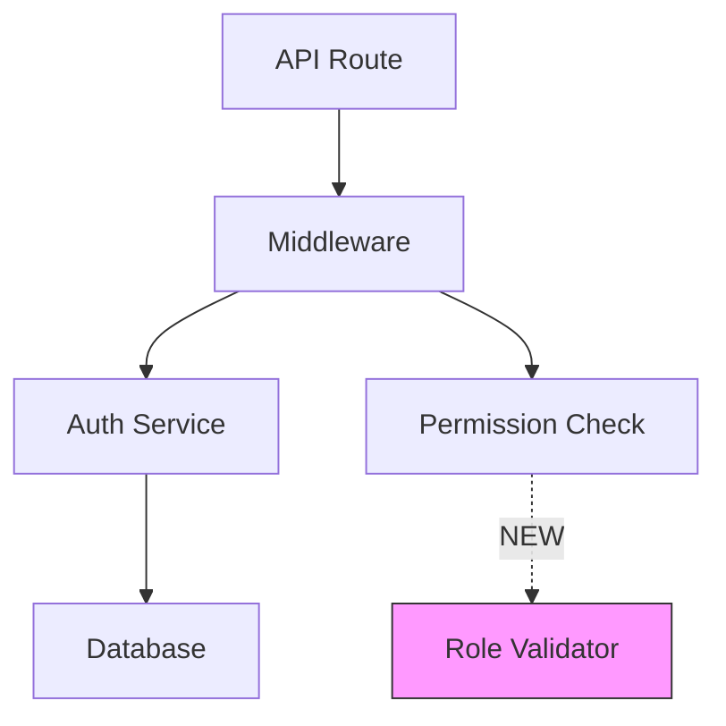
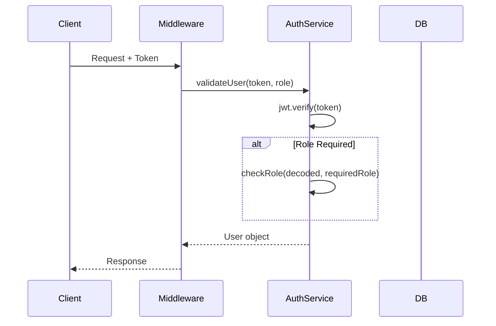

# Workflow: Deep Design

**Purpose**: Deeply analyze the codebase, identify uncertainties, and build a comprehensive design blueprint.
**Combines**: Previous understand + planning workflows into a single deep-thinking phase.

---

## Step 1: Load Context from Intake

Read session state from intake:
- Mode (A: existing codebase / B: new project)
- Task description and target area
- Tech stack detected

---

## Step 2: Deep Code Analysis (Mode A)

### 2.1 Locate Target Symbols

Use Grep/Serena to find target functions/classes:

```
Grep: "functionName" path="src/**/*.ts"
```

### 2.2 Trace Execution Flow

Follow the full call chain:

```
Entry: POST /api/login
  → src/app/api/login/route.ts: POST handler
    → src/services/auth.ts: validateCredentials()
      → src/services/auth.ts: generateToken()
    → src/lib/session.ts: createSession()
```

### 2.3 Map All Callers and Dependencies

Find every location that calls the target:

```
Grep: "functionName(" path="src/**/*.ts"
```

Document as dependency map:

| Caller | File:Line | Impact |
|--------|-----------|--------|
| ... | ... | ... |

### 2.4 Assess Breaking Change Risk

| Change Type | Risk | Mitigation |
|-------------|------|------------|
| Add optional param | 🟢 Low | None needed |
| Add required param | 🔴 High | Update all callers |
| Change return type | 🔴 High | Update all consumers |
| Modify behavior | 🟡 Medium | Update tests |

### 2.5 Identify Test Coverage

```
Grep: "functionName" path="**/*.test.ts"
Grep: "functionName" path="**/*.spec.ts"
```

---

## Step 3: Design Architecture (Mode A + B)

### 3.1 Build Mental Model

Think deeply about:

1. **What exists now**: Current architecture, patterns, conventions
2. **What needs to change**: Minimal set of modifications
3. **How changes interact**: Ripple effects, side effects
4. **What could go wrong**: Edge cases, race conditions, type issues

### 3.2 Draft Architecture Diagram (Mermaid)

Create a flowchart showing component relationships:



Mark new/modified components clearly.

### 3.3 Draft Sequence Diagram (Mermaid)

Create a sequence diagram showing the interaction flow:



### 3.4 Draft File Change Map

| File | Change Type | What Changes |
|------|-------------|-------------|
| `src/types/auth.ts` | Modify | Add Role enum |
| `src/services/auth.ts` | Modify | Add role param to validateUser |
| `src/middleware/auth.ts` | Add | New requireRole() middleware |

---

## Step 4: Identify Uncertainties

### 4.1 Categorize Unknowns

For each uncertainty found during analysis, categorize:

| Uncertainty | Type | Needs User Input? |
|-------------|------|-------------------|
| Error handling approach | Design choice | Yes |
| Which callers to update first | Priority | Yes |
| Test framework to use | Tooling | Maybe (check existing) |
| Backward compatibility strategy | Architecture | Yes |

### 4.2 Ask Targeted Questions via AskUserQuestion

🔴 **CRITICAL**: Use `AskUserQuestion` with concrete choices (2-4 options).
Do NOT ask open-ended questions. Provide specific, actionable options.

**Format for each uncertainty**:

```
AskUserQuestion:
  question: "エラーハンドリングはどの方式にしますか？"
  header: "Error"
  options:
    - label: "既存パターンに合わせる"
      description: "プロジェクトの既存のエラーハンドリングパターンを踏襲"
    - label: "カスタムエラー型を導入"
      description: "UnauthorizedError, ForbiddenError 等の専用型を新規作成"
    - label: "Result型パターン"
      description: "Either/Result型でエラーを戻り値として表現"
```

### 4.3 Incorporate Answers into Design

After receiving user's answers:
- Update architecture diagram to reflect choices
- Adjust sequence diagram for chosen patterns
- Finalize file change map

---

## Step 5: Build Section Plan

### 5.1 Break Into Sections

Group related changes into logical sections (S01, S02, ...):

- Each section: focused on one concern
- Clear dependencies between sections
- Section order follows natural build-up

### 5.2 Create TODOs per Section

Each section contains concrete TODOs:

```markdown
## Section S01: [Name]

### TODOs
- T01.1: [Specific task]
- T01.2: [Specific task]
- T01.3: [Specific task]

### Validation
- [Specific check]
```

### 5.3 Include Impact Mitigation TODOs (Mode A)

For caller updates, test updates, and regression watches:

```markdown
- T01.4: Update callers in src/routes/api/users.ts (3 locations)
- T01.5: Update existing tests in auth.test.ts
- T01.6: Add new tests for role validation
```

---

## Step 6: Save Design State

Save the complete design for plan-gate:

```json
{
  "design": {
    "architecture_diagram": "mermaid source",
    "sequence_diagram": "mermaid source",
    "file_change_map": [],
    "uncertainties_resolved": { "error_handling": "custom_error_types" },
    "breaking_change_risk": "Medium",
    "sections": []
  }
}
```

---

## Step 7: Route to Plan Gate

→ `workflows/plan-gate.md`

Pass the complete design (diagrams + plan + resolved uncertainties).

---

## Success Criteria

- [ ] Code thoroughly analyzed (callers, tests, dependencies)
- [ ] Architecture diagram drafted (Mermaid flowchart)
- [ ] Sequence diagram drafted (Mermaid sequence)
- [ ] All uncertainties identified
- [ ] User questions asked via AskUserQuestion with concrete choices
- [ ] Answers incorporated into design
- [ ] Sections and TODOs structured
- [ ] Design state saved
- [ ] Routed to plan-gate
