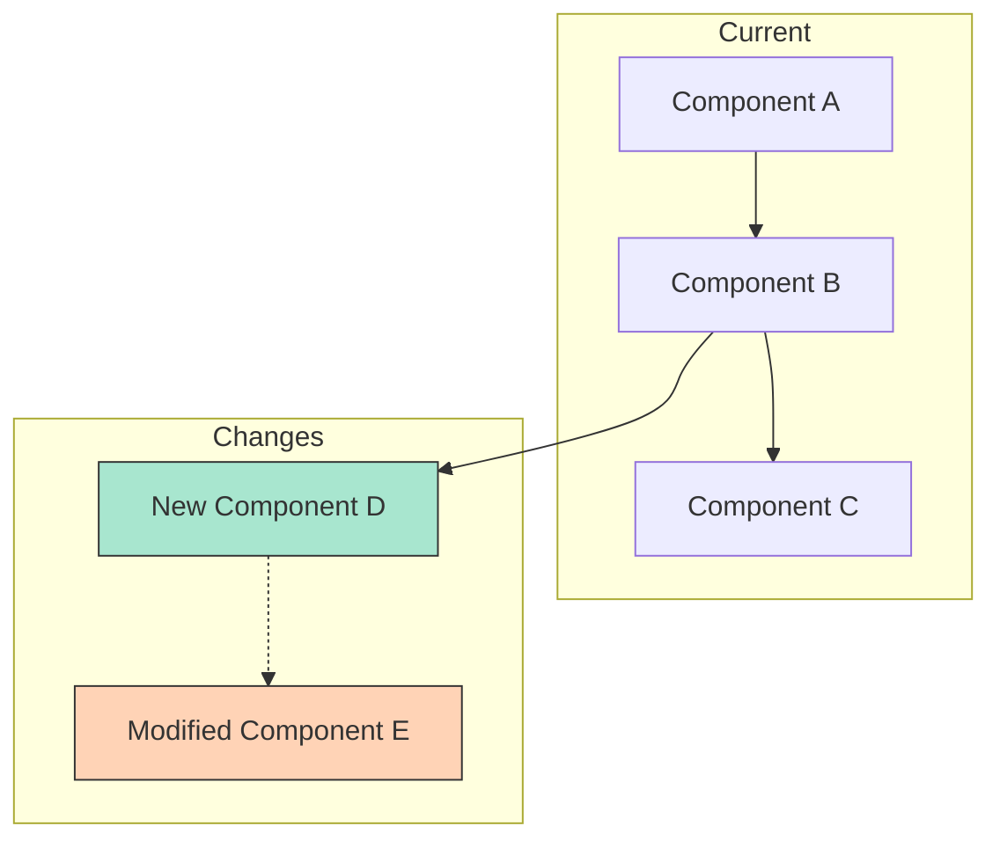
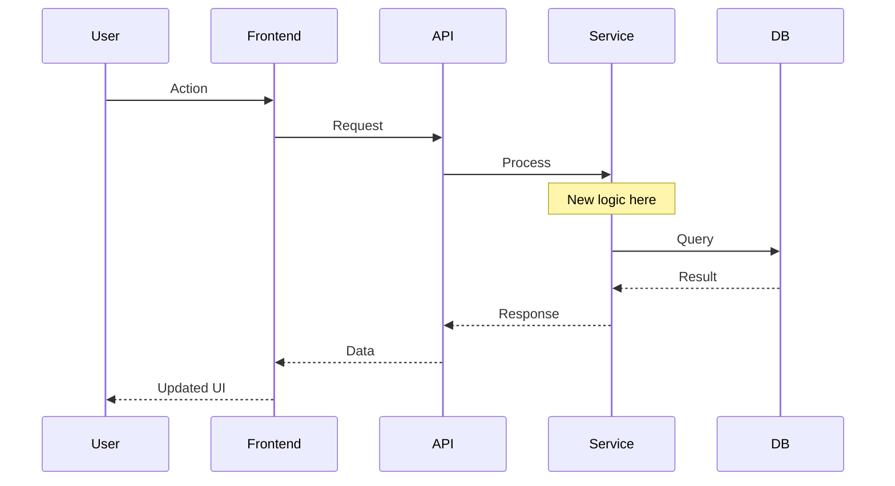
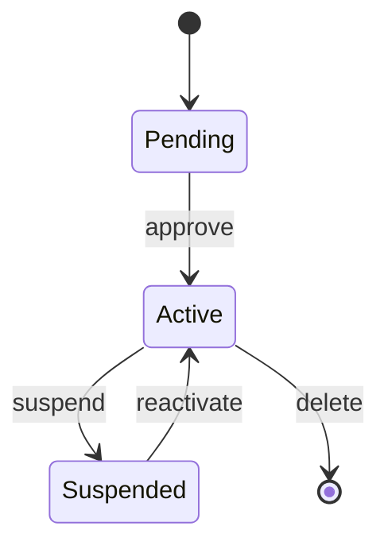
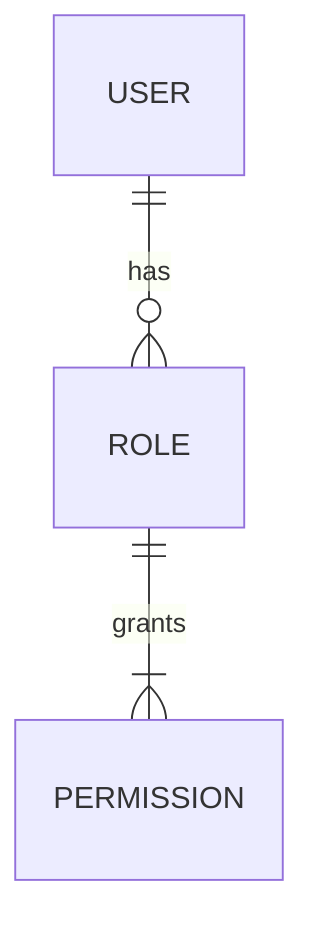
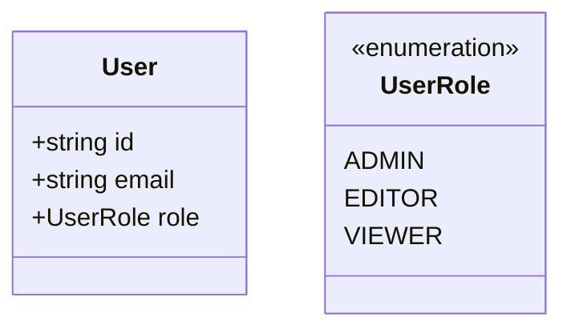

# Workflow: Plan Gate

**Purpose**: Present the design blueprint with visual diagrams and get explicit human approval.
**This is the acceptance gate — nothing proceeds without human's "accept".**

---

## Presentation Philosophy

🔴 **Diagrams first, text second.**

The design presentation prioritizes visual comprehension:
1. Architecture diagram shows WHAT changes and WHERE
2. Sequence diagram shows HOW the new flow works
3. File change table shows the SCOPE
4. TODO plan shows the STEPS

---

## Step 1: Present Design Blueprint

### Template

```markdown
🧠 **Design Blueprint: [Task Name]**

---

## 1. Architecture Overview



**Legend**: 🟢 New | 🟠 Modified | ⬜ Unchanged

---

## 2. Interaction Flow



---

## 3. Change Scope

| File | Action | What Changes |
|------|--------|-------------|
| `path/file1.ts` | 🟠 Modify | Add role parameter |
| `path/file2.ts` | 🟢 Create | New middleware |
| `path/file3.ts` | 🟠 Modify | Update type definitions |

**Breaking Change Risk**: [🟢 Low / 🟡 Medium / 🔴 High]
**Reason**: [Brief explanation]

---

## 4. Design Decisions

| Decision | Choice | Rationale |
|----------|--------|-----------|
| [Decision 1] | [Chosen option] | [Why this was chosen] |
| [Decision 2] | [Chosen option] | [Based on user's answer] |

---

## 5. Implementation Plan

### Section S01: [Name]
- T01.1: [Task]
- T01.2: [Task]
- T01.3: [Task]

### Section S02: [Name]
- T02.1: [Task]
- T02.2: [Task]

### Section S03: [Name]
- T03.1: [Task]
- T03.2: [Task]

**Total**: [N] sections, [M] TODOs

---
```

---

## Step 2: Ask for Approval

After presenting the full blueprint, ask for explicit approval:

```
AskUserQuestion:
  question: "この設計で進めてよいですか？"
  header: "Plan Gate"
  options:
    - label: "Accept (実装開始)"
      description: "この設計プランを承認し、Section S01 からガイド開始"
    - label: "Adjust (調整)"
      description: "設計の一部を変更したい箇所がある"
    - label: "Redesign (再設計)"
      description: "アプローチを根本的に変えたい"
```

---

## Step 3: Handle Response

### Accept → Proceed to Implementation

```markdown
✅ **Plan Approved**

Starting with Section S01: [Name]
Proceeding to implementation guidance...
```

→ Route to `workflows/section-guidance.md` (Section S01, TODO T01.1)

### Adjust → Iterate on Design

1. Ask what needs adjustment:
   ```
   What would you like to change? Please describe the adjustments.
   ```

2. Update the affected parts of the design
3. Re-present the updated blueprint
4. Return to Step 2 (ask for approval again)

### Redesign → Back to Deep Design

```markdown
🔄 **Redesigning**

Let's rethink the approach. What direction would you prefer?
```

→ Route back to `workflows/deep-design.md` with new constraints

---

## Diagram Guidelines

### Architecture Diagram (graph TD)

**DO**:
- Use `subgraph` to group related components
- Color-code: green for new (`#a8e6cf`), orange for modified (`#ffd3b6`)
- Show data flow direction with arrows
- Mark new connections with dotted lines (`-.->`)
- Keep under 15 nodes for readability

**DON'T**:
- Include every file in the project
- Show implementation details inside nodes
- Use more than 3 levels of nesting

### Sequence Diagram

**DO**:
- Show the happy path first
- Use `alt` blocks for important branches
- Add `Note` annotations for key logic
- Include error paths if they're part of the design
- Show only participants relevant to the change

**DON'T**:
- Include every HTTP header or parameter
- Show database schema details
- Make it longer than ~20 interactions

### Additional Diagrams (Optional)

For complex designs, consider adding:

**State Diagram** (for state machines):


**ER Diagram** (for data model changes):


**Class Diagram** (for type hierarchy):


Use additional diagrams only when they add clarity to the design.

---

## Success Criteria

- [ ] Architecture diagram presented (Mermaid flowchart)
- [ ] Sequence diagram presented (Mermaid sequence)
- [ ] Change scope table with file list
- [ ] Design decisions documented
- [ ] Implementation plan with sections and TODOs
- [ ] User explicitly approved the plan via AskUserQuestion
- [ ] If adjusted: changes incorporated and re-presented
- [ ] Approved plan saved to session state
- [ ] Routed to section-guidance workflow
