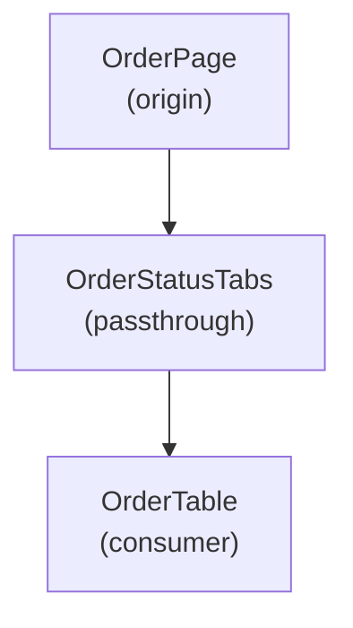

# Prop Drill — React Props Origin & Drilling Path Tracer

## Core Value

Find where an unknown prop is **originally defined** and show the complete
drilling path through the component tree. The origin code is displayed as a
**clickable code block** in Cursor IDE so the user can jump to it instantly.

## Input

Parse the user's input to extract:
- **prop name** (required) — the prop to trace
- **component name or file path** (optional) — narrows the search scope

Examples of valid inputs:
- `orderData`
- `orderData OrderTable`
- `orderData src/features/shared/order_status_tabs/order_table/OrderTable.tsx`
- `isOpen NewOrderModal`

## Workflow

### Phase 1: Find the Prop's Type Definition

Locate the `type` or `type ... Props` that declares this prop.

**If Serena MCP is available:**
1. `search_for_pattern` with `propName` in `*.tsx` / `*.ts` files filtered to type definitions
2. `find_symbol` with `include_body=True` on the matched Props type
3. If the prop is inherited via `&` (intersection) or utility types, trace to the original type

**Otherwise (standard tools):**
1. `Grep` for the pattern `propName\s*[\?:]` in `*.ts` / `*.tsx` to find type declarations
2. `Read` the matched files to confirm the type definition context
3. Follow intersection types / imported types to the original declaration

If `sequential-thinking` MCP is available, use it to plan the trace strategy
before searching (especially useful when prop name is ambiguous or common).

### Phase 2: Find the Data Origin

Identify where the prop's **value** is first created (not just passed through).

Look for patterns:
- `useState` / `useReducer` — local state
- `useQuery` / `useSWR` / `fetch` — API data
- `useMemo` / `useCallback` — computed values
- Literal values / constants — static data
- Function parameters — from parent (continue tracing upward)

**If Serena MCP is available:**
- `find_referencing_symbols` on the Props type to list all components using it
- Read component bodies to find where the value is generated vs merely forwarded

**Otherwise:**
- `Grep` for `<ComponentName` or `propName={` to find where the prop value is created
- `Read` those files to distinguish origin from passthrough

### Phase 3: Trace the Drilling Path

Starting from the origin component, trace downward through JSX:

1. Read the origin component body
2. Find JSX where `propName={...}` is passed to a child component
3. Move to that child component's file
4. Check if the child uses the prop directly (consumer) or passes it further (passthrough)
5. Repeat until reaching all leaf consumers

Record for each step:
- Component name
- File path and line number
- Prop name at that level (detect renames like `data={orderData}`)
- Role: `origin` | `passthrough` | `consumer`
- Code snippet (abbreviated)

**If Serena MCP is available:**
- `find_referencing_symbols` to efficiently discover child usage
- `get_symbols_overview` to quickly map component structure

### Phase 4: Knowledge Enrichment (optional)

If available:
- **context7**: Look up React documentation on props patterns if the user seems unfamiliar
- **exa**: Search for prop-drilling alternative patterns (Context, composition) for the improvement suggestions section

## Output Format

Output in this exact order. The clickable code block is the **most important** part.

### Section 1: Origin Definition (REQUIRED, FIRST)

Show the prop's type definition and value origin as Cursor IDE clickable code blocks.
Use the `startLine:endLine:filepath` format (relative path from project root).

````markdown
## Origin: `propName`

### Value created at:

```25:30:src/pages/orders/table.tsx
const orderData = useQuery({
  queryKey: ["orders"],
  queryFn: fetchOrders,
});
```

### Type defined at:

```12:16:src/types/order.ts
type OrderData = {
  id: string;
  status: OrderStatus;
};
```
````

Rules for code blocks:
- Use `startLine:endLine:filepath` — NO language tag, NO other metadata
- Path must be relative from project root
- Include enough surrounding lines for context (typically 3-8 lines)
- Always include at least 1 line of actual code

### Section 2: Drilling Path Table (REQUIRED)

````markdown
## Drilling Path

| # | Component | File:Line | Prop Name | Role | Code |
|---|-----------|-----------|-----------|------|------|
| 1 | OrderPage | src/pages/orders/table.tsx:25 | orderData | origin | `const orderData = useQuery(...)` |
| 2 | OrderStatusTabs | src/features/.../OrderStatusTabs.tsx:40 | orderData | passthrough | `<OrderTable orderData={orderData} />` |
| 3 | OrderTable | src/features/.../OrderTable.tsx:15 | orderData | consumer | `orderData.map(...)` |
````

Role definitions:
- **origin**: Where the prop value is first created
- **passthrough**: Receives and forwards without transformation
- **consumer**: Uses the prop value directly (renders, calls methods, etc.)
- **transform**: Receives, transforms, then passes a derived value

### Section 3: Mermaid Flowchart (REQUIRED)

````markdown
## Component Flow


````

Mermaid rules:
- No spaces in node IDs (use PascalCase)
- Label in double quotes with `\n` for line breaks
- Show role in parentheses under component name
- If prop is renamed between components, add edge label: `-->|"renamed: data"|`

### Section 4: Improvement Suggestions (OPTIONAL)

Only show when drilling depth >= 3 layers.

````markdown
## Suggestions

This prop passes through **N** layers. Consider:
- **Context API**: Extract `propName` into a Context provider at the `OriginComponent` level
- **Composition pattern**: Pass the consuming component as children instead of drilling the data
````

If `exa` MCP is available, search for real-world examples of the suggested pattern.

## Tool Priority

All MCP tools are optional. Use when available, fall back to standard tools.

| Need | Preferred (MCP) | Fallback (standard) |
|------|-----------------|---------------------|
| Find type definitions | Serena `search_for_pattern` + `find_symbol` | `Grep` + `Read` |
| Find references | Serena `find_referencing_symbols` | `Grep` for component usage |
| File structure | Serena `get_symbols_overview` | `Glob` + `Read` |
| Plan trace strategy | `sequential-thinking` | Skip (proceed directly) |
| React docs | `context7` | Skip |
| Alternative patterns | `exa` | Skip |

## Success Criteria

- [ ] Prop's type definition located and shown as clickable code block
- [ ] Prop's value origin located and shown as clickable code block
- [ ] Complete drilling path from origin to all consumers documented in table
- [ ] Mermaid flowchart accurately represents the component tree
- [ ] Prop renames between components detected and noted
- [ ] No false positives (components listed that don't actually handle this prop)
